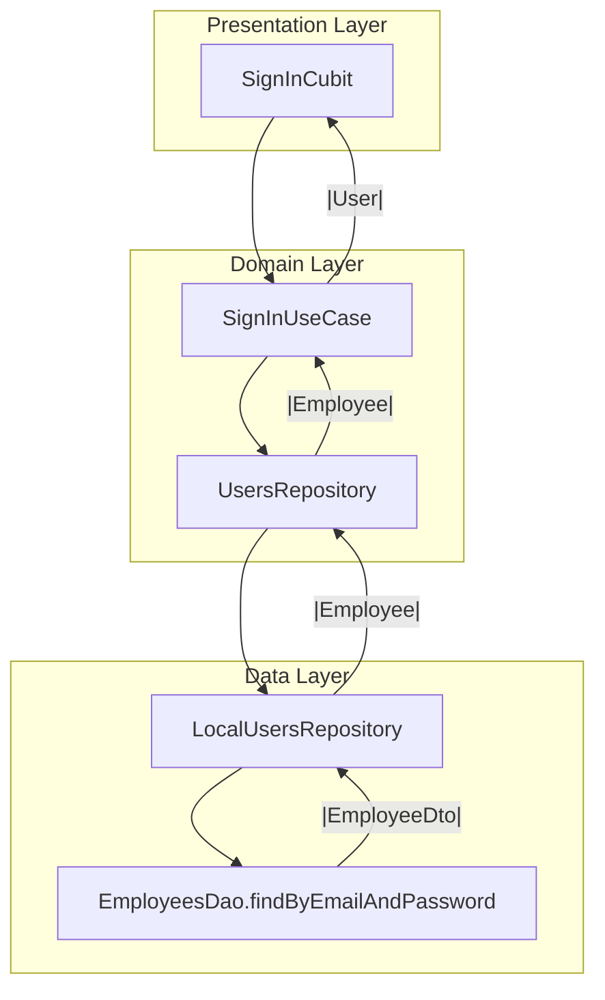
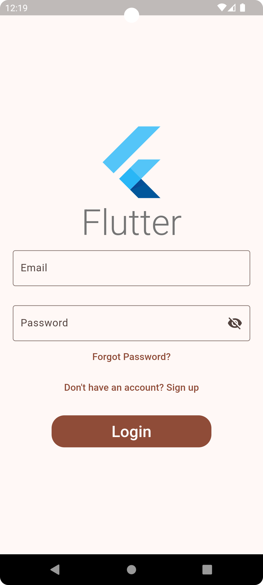
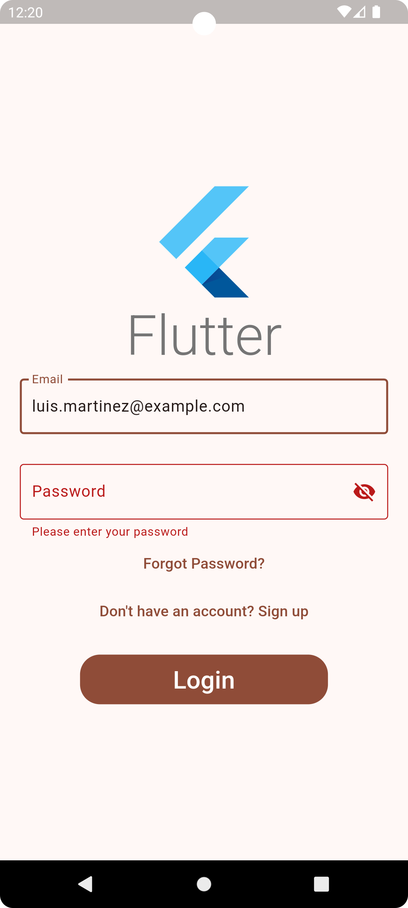
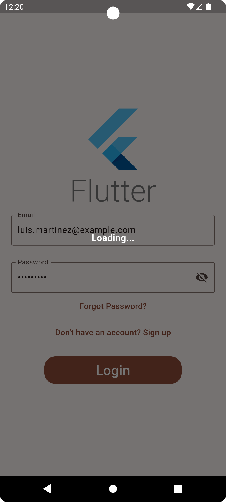
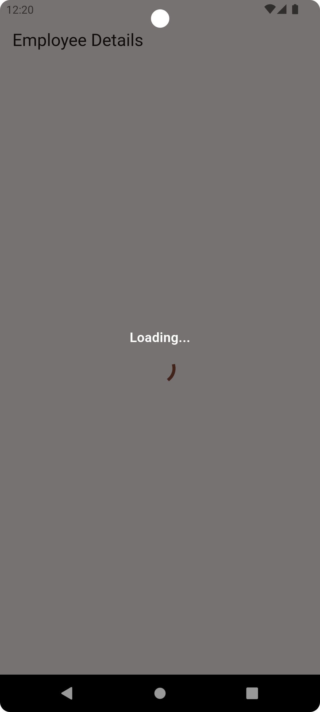
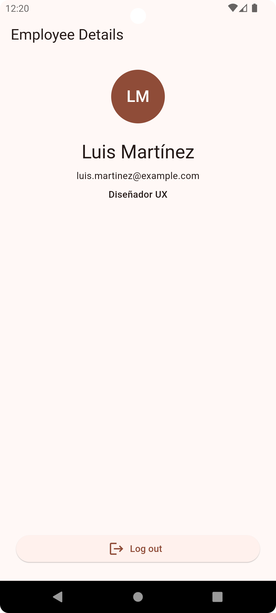

# Employee Login App

This is a Flutter technical exercise that demonstrates a simple login flow using local data storage.
The application is designed to run on both Android and iOS devices.

## 📱 Features

- Two screens:
    - **Login Screen:** Authenticate using locally stored employee credentials.
    - **Home Screen:** Displays employee name and job title after successful login.
- Pre-populated local database with dummy employee data.
- Validates input for email and password.
- Persists logged-in user using SharedPreferences.
- Clean navigation using go_router.

## 🧱 Architecture

This project follows a **clean architecture** structure, divided into:

- **data**: Contains the data layer with DTOs, local database (Floor), and repository
  implementations.
- **domain**: Defines repositories and use cases. Uses Either<Exception, T> (from dartz) for
  structured error handling.
- **presentation**: UI and state management, organized using **MVI** (Model-View-Intent) pattern
  with **Cubit** from the flutter_bloc package.

### Architecture Flow (Sign-In)

This diagram shows the login flow across the clean architecture layers:

- The **SignInCubit** in the presentation layer initiates the login.
- It calls the **SignInUseCase** in the domain layer.
- The use case uses the **UsersRepository** interface, implemented by **LocalUsersRepository** in
  the data layer.
- The repository queries the local database via **EmployeesDao.findByEmailAndPassword**.
- The result, an **EmployeeDao**, is mapped into a **domain-level Employee** entity before being
  returned upstream.
- Later, the **SignInUseCase** maps the entity into a **presentation-level User** to be used in the
  **SignInCubit**.

## 💾 Local Storage

Uses Floor for SQLite persistence.

- The database is pre-populated on first launch using a bundled JSON file containing sample employee
  records.
- One of the seeded employees is:  
  email: luis.martinez@example.com  
  password: secure456

## 🔐 Authentication Flow

- Input validation ensures that both email and password are not empty.
- If credentials match an employee in the database, the user is logged in and redirected to the home
  screen.
- If login fails, an error is shown using toast notifications.
- On successful login, the employee's ID is stored in SharedPreferences to persist the session.
- On logout, the stored user ID is cleared and the app navigates back to the login screen.

## 🚀 Getting Started

### Prerequisites

- Flutter SDK
- Dart SDK
- Android Studio or Xcode for emulator or device testing

### Steps to Run

1. Clone the repository and enter the project folder
2. Run `flutter pub get` to install dependencies
3. Run `flutter pub run build_runner build` to generate Floor database code
4. Launch the app using `flutter run`

## 🛠️ Packages Used

- flutter_bloc – for Cubit/MVI state management
- floor – SQLite abstraction for local persistence
- shared_preferences – to persist logged-in user ID
- go_router – declarative routing
- injectable – for dependency injection
- get_it – service locator for dependency management (required by injectable)

## 📸 Screenshots

- **Login screen**

  
  
  

- **Home screen**

  
  

## ✅ Areas of Improvement

Given more time, the following could be improved or added:

### 🔧 Technical and UX Enhancements

- More robust error handling and user-friendly error messages
- Input validation using `formz` or custom form validators
- UI polish and accessibility improvements

### 🧪 Testing

- Unit tests for use cases, repositories, and Cubits
- Widget tests for screens and interactions

### 🧱 Architecture and Maintainability

- Extract constants and themes into dedicated modules
- Improve exception hierarchy and domain error mapping

